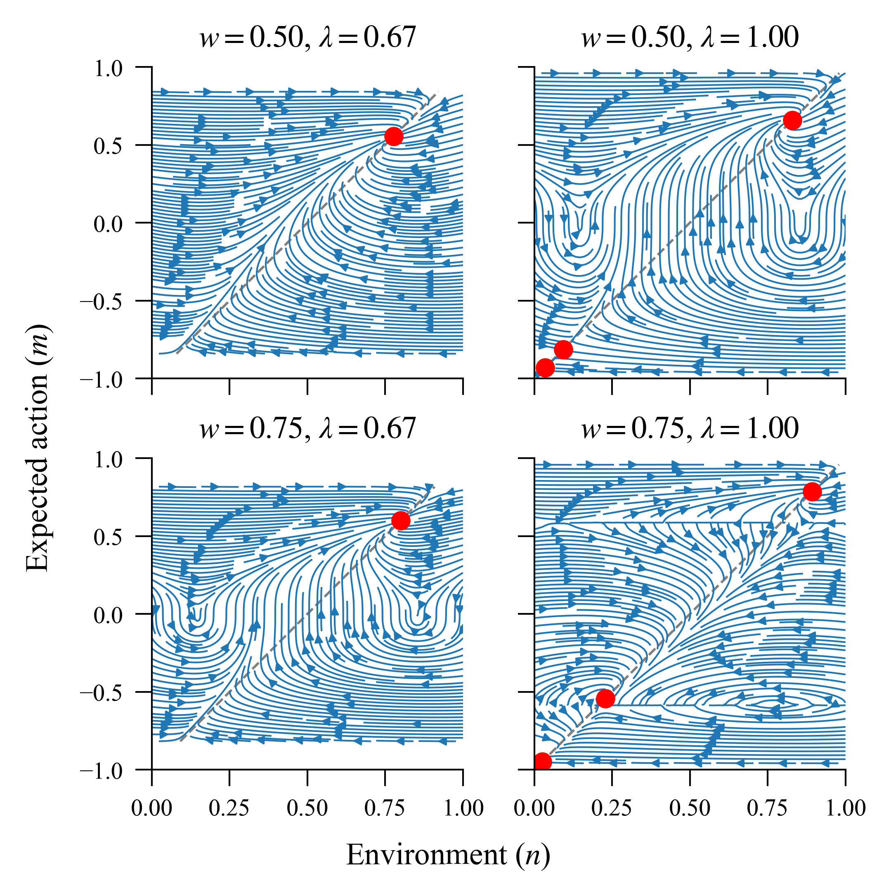

.. ABM Project documentation master file, created by
   sphinx-quickstart on Tue Jun 10 12:37:11 2025.
   You can adapt this file completely to your liking, but it should at least
   contain the root `toctree` directive.

Climate-related Decision-making ABM
===================================

This project uses agent-based modelling to investigate the feedback cycle between 
public support for climate action and individually-perceived climate change severity.

.. image:: figures/11b_env.gif
   :width: 70%
   :align: center

Check out the :doc:`getting_started` section for details on how to contribute to this
project, or :doc:`experiments` to reproduce our experiments.

The repository is licensed under the `MIT License <https://github.com/VictorianHues/AgentBasedModeling/blob/main/LICENSE>`_. 

Contents
--------

.. toctree::
   :maxdepth: 1

   getting_started
   experiments
   api
   contributing

